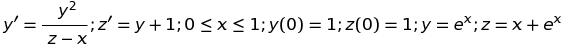

# Численные методы

## Лабораторная работа № 1
## "Приближенное решение задачи Коши для системы обыкновенных дифференциальных уравнений методами Эйлера"

[Задание:](./NM/Lab01/%D0%97%D0%B0%D0%B4%D0%B0%D0%BD%D0%B8%D0%B501.txt)

1. Написать программу приближенного решения задачи Коши с выводом графиков приближенных решений на экран. Вар.2 Исходные данные: 

- дан отрезок [a, b], значения y', z' и точное решение:

2. На основании этого провести численный эксперимент и сделать выводы о сходимости при стремлении шага сетки к 0 (т.е. при стремлении N к бесконечности).

Использовать методы приближенного решения:
- явный метод Эйлера;
- неявный метод Эйлера.

UPD: [Решение на Matlab](./NM/Lab01/matlab)

## Отчет л.р. №1 [Word](./NM/Reports/NM_Lab01_with_listing.docx) и [PDF](./NM/Reports/NM_Lab01_with_listing.pdf)

-------

## Трекинг и описание

### 2018-03-03
#### Добавлено решение работы №1 (Matlab)
[Задание:](./NM/Lab01/%D0%97%D0%B0%D0%B4%D0%B0%D0%BD%D0%B8%D0%B501.txt)
(явный и неявный методы Эйлера)

LINK: [Решение на Matlab](./NM/Lab01/matlab)

-------

### 2018-03-04
#### UPD: добавил отчет л.р. №1 [Word](./NM/Reports/NM_Lab01_with_listing.docx) и [PDF](./NM/Reports/NM_Lab01_with_listing.pdf)

-------
